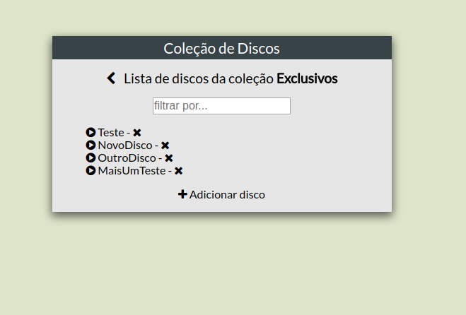

# Discs Collection Front-End

O projeto foi iniciado com [Angular CLI](https://github.com/angular/angular-cli) versão 1.6.3.

## Screenshot
<div style="width:100%;text-align:center">

</div>

## Como executar
- Se certifique que possui o [discs-collection-api](https://github.com/matheusrabelo/discs-collection-api) devidamente configurado e rodando
- Clone este repositório
- Execute os seguintes comandos:

```
$ npm install
$ ng serve
```

## Autor
Matheus Freire Rabelo
